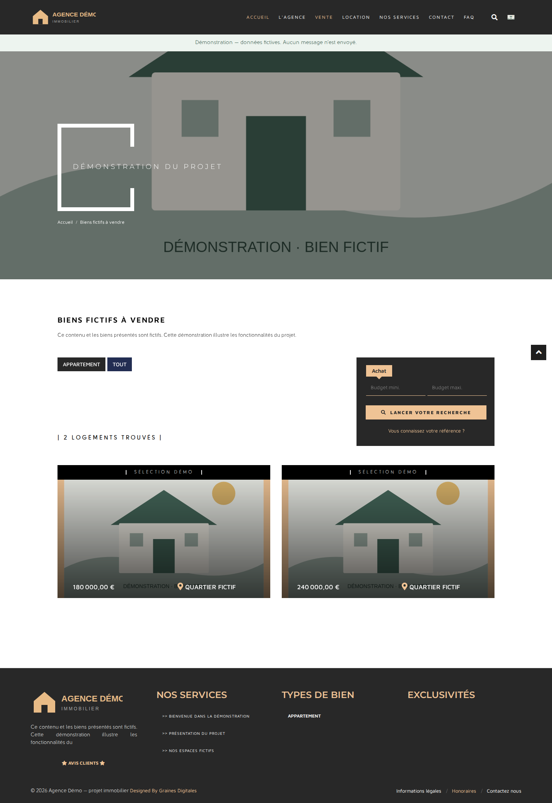

# L’Immobilière d’Essaouira

Plateforme immobilière avec un site public bilingue et une administration pour gérer les biens, les locations et les contenus éditoriaux.

Ce dépôt présente une application existante et son environnement de développement. Il utilise Symfony 4.2 et Nuxt 2 : il reflète une réalisation historique, avec des limites et des pistes de modernisation documentées.

## Fonctionnalités présentes dans le code

- Catalogue de biens à vendre et à louer, recherche et pages de détail.
- Contenus éditoriaux, pages institutionnelles et formulaire de contact.
- Gestion des biens, médias, personnes, locations et factures dans l’administration.
- Traductions français/anglais et génération de données et de routes pour le site.
- Métadonnées pour le référencement et traitement des images.

## Organisation

| Dossier | Rôle |
| --- | --- |
| `digital-management-system/` | Administration Symfony, API, modèle de données et commandes d’export |
| `nuxt-modern-website/` | Site Nuxt 2, composants Vue, pages et traductions |
| `nginx/` | Serveur HTTP local pour Symfony |
| `scripts/` | Vérifications du dépôt et synchronisation privée |
| `docs/` | Architecture, conventions et limites connues |

## Découvrir le projet

- [Architecture et circulation des données](docs/architecture.md)
- [Installation locale](SETUP.md)
- [Conventions de contribution](CONTRIBUTING.md)
- [Limites et travaux à prévoir](docs/roadmap.md)
- [Vérifications réalisées](docs/validation.md)
- [Gestion des données et identifiants](SECURITY.md)
- [Préparation d’une copie publique sans ancien historique](docs/publication.md)

## Environnement local

Docker Compose orchestre PHP 7.4, Node 16, MySQL 8, Nginx et MailHog. Les fichiers de dépendances verrouillent les versions PHP et JavaScript.

Une **[démonstration avec trois biens fictifs](docs/demo.md)** permet de découvrir le site sans base de production :

```bash
python3 scripts/prepare-demo.py
docker compose -f docker-compose.demo.yml up -d --build
```

Utiliser un clone propre : la préparation refuse d’écraser des ressources locales existantes. Les formulaires et les appels externes sont désactivés dans cette démonstration.

Suivre [SETUP.md](SETUP.md) pour préparer les services et les ressources nécessaires. Les vérifications statiques disponibles s’exécutent avec `bash scripts/check.sh` ; elles sont complétées par les [tests navigateur de la démonstration](docs/demo.md). L’administration reste à vérifier séparément.

## Aperçu de la démonstration

Les captures montrent des données et illustrations fictives.

<details>
<summary>Voir le catalogue de démonstration</summary>



</details>

[Voir aussi l’accueil](docs/images/demo-accueil.png).

## Licence

La licence du dépôt est [GPL-3.0](LICENSE). Les bibliothèques et ressources tierces conservent leurs licences respectives. La propriété et les droits de redistribution des médias métier doivent être vérifiés avant leur réutilisation.
