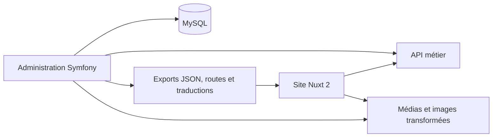

# Architecture

Le dépôt rassemble deux applications reliées par une API et des fichiers générés.

## Administration

`digital-management-system/src/Entity` décrit les biens, locations, personnes, contenus et factures. Les contrôleurs gèrent les parcours d’administration et les actions métier. EasyAdmin, API Platform, Doctrine et Twig complètent Symfony.

Les commandes dans `src/Command` génèrent notamment les exports JSON, les traductions, les routes et les métadonnées des médias.

## Site public

`nuxt-modern-website/pages` contient les pages de vente, location, actualités, contact et présentation. Les composants du thème immobilier se trouvent dans `components/theme-modern-immobilier`. Le dossier `store` gère les données affichées. Le site utilise Vue, Bootstrap et des plugins jQuery.

Nuxt est configuré avec une cible statique. Il importe des fichiers JSON au chargement de sa configuration et utilise aussi des appels API. La génération nécessite donc des exports cohérents et, selon le parcours, un backend disponible.

## Environnement

Docker Compose monte les sources locales. Le backend accède au dossier du site via `/app` pour écrire les exports. Nginx expose PHP-FPM ; MySQL conserve ses données dans un volume. MailHog fournit une boîte de réception locale, mais la configuration du transport email doit être adaptée pour l’utiliser.

Il s’agit d’un environnement de développement. Aucune procédure de déploiement reproductible ni validation de production n’est fournie.
